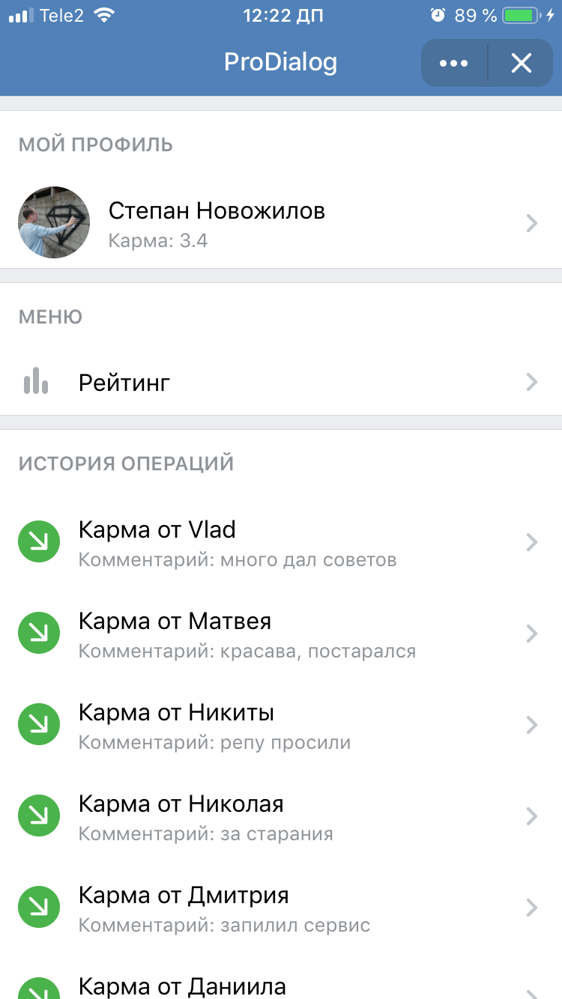

# ProDialog VK App

VK App for ProDialog

## Technologies
*   React
*   Redux
*   Rematch
*   VK UI
*   VK Connect / VK Connect Promise

## How to run
*   Clone repo
*   `yarn` or `npm install`
*   `yarn start` or `npm start`
*   Your copy will be launch on `127.0.0.1:10888`

## Links
*   [Official app in VK](https://vk.com/app6982755)
*   [Developer](https://vk.me/this.state.user)
